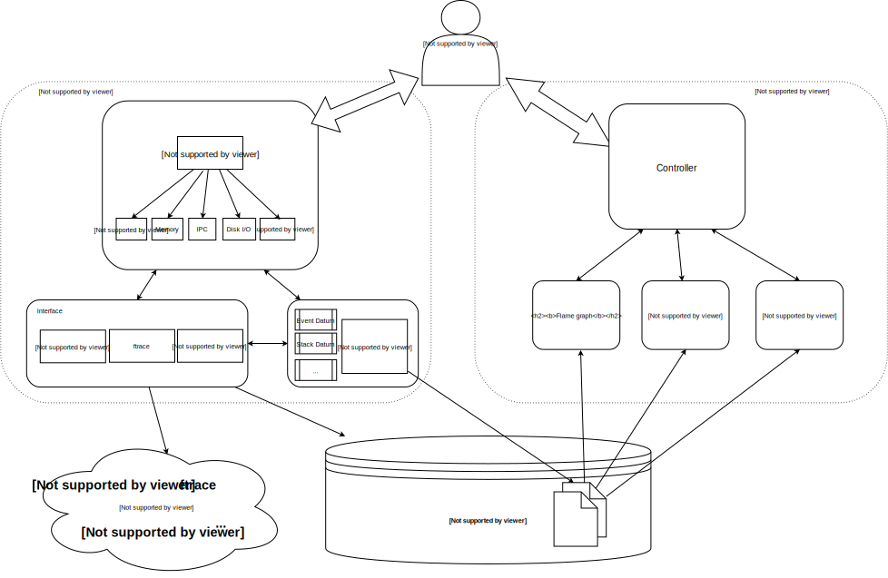
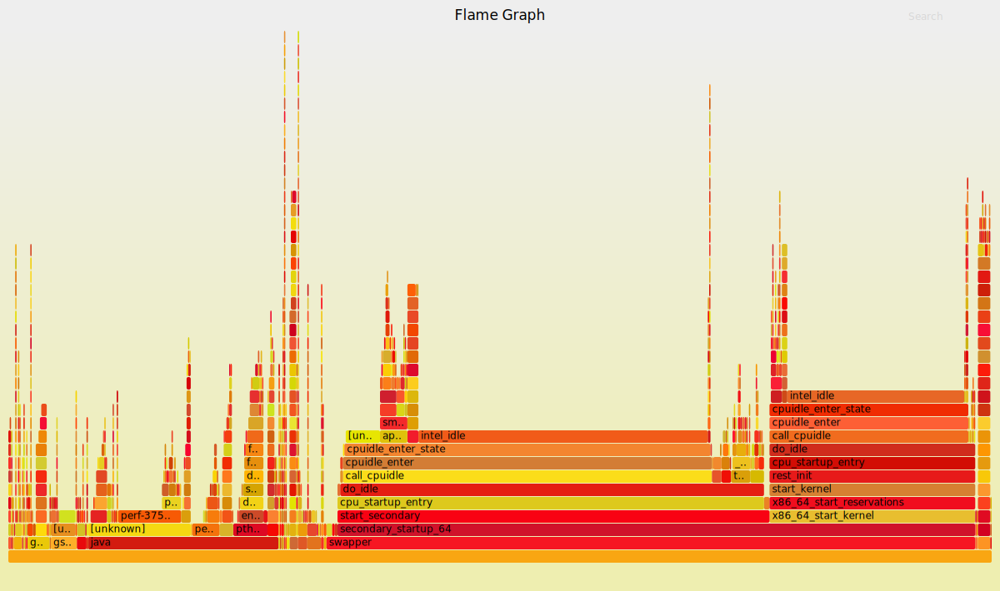

# MARPLE - Multi-tool Analysis of Runtime Performance on Linux Environments

## Description
MARPLE is a tool designed to provide an easy way to collect and display Linux performance data such as CPU events, memory allocations, efficiency of IPC, etc. 

There is a wide variety of Linux tools for this purpose, such as perf, ftrace, strace, eBPF, ... which are very powerful but need some time to grasp and get comfortable using. 

MARPLE provides an interface to these these tools that is quick and easy to use as a first step in analysing the system.  It also has facilities to display the data graphically to help visualise problems which is useful for both software engineers and system analysts.

## Design
The design is modular, with a controller module as the user interface at the top, different function modules in the middle,  and lower level modues interaction directly with the system, other tools and the file system.  The controller is the point of contact through which the user can interact with lower level system tools.  The main focus is transparency, i.e. the user just specifies what part of the system she wants to analyse  and the tool infers what lower level module is most suitable for the task,  be it using trace points or k-probes, without the user having to worry about these details.

 

**Figure 1:** Modular structure of the MARPLE tool with three layers of modules.

## Setup and execution (preliminary)
  make sure you have python 3 and perl installed

 1. clone or download the git repository at [https://github.com/ensoft/marple](https://github.com/ensoft/MARPLE)

 2. install linux-tools (needed for perf to work)

~~~~

sudo apt-get install linux-tools-generic linux-tools-common linux-tools-`uname -r`

~~~~

  change the sudoers file to adopt changes to PYTHONPATH:

~~~~

sudo visudo

#add the following line:

Defaults        env_keep += "PYTHONPATH"

#exit and save

^X

~~~~

  The following currently needs to be run every time a new shell session is started:

~~~~

#cd to the code directory, e.g.:

cd ~/PycharmProjects/marple

#export python environment variable

export PYTHONPATH=.

#create an alias to smoothly call the command (preliminary solution)

alias marple='sudo python3 main.py'

~~~~

  Now, marple commands can be executed as described in the "API" section, e.g.:

~~~~

marple collect -s -f "outputfile" -t 5

~~~~

Note: In order to run the display module, you currently need to change the method in the display/flamegraph.py module to change user to your username.

## API
The program can be called with two main functions: one for collecting data and one for displaying it. 

Note here we assume the program has been built into an executable.

### Collecting data
~~~~

usage: marple collect [-h] (-s | -l | -i | -m) [-f FILE] [-t TIME]

optional arguments:

  -h, --help            show this help message and exit

  -c, --cpu             cpu scheduling data

  -i, --ipc             ipc efficiency

  -l, --lib             library load times

  -m, --mem             memory allocation/ deallocation

  -s, --stack           stack tracing

  -f FILE, --file FILE  Output file where collected data is stored

  -t TIME, --time TIME  time in seconds that data is collected

~~~~

### Displaying data
~~~~

optional arguments:

  -h, --help            show this help message and exit

  -c, --cpu             cpu scheduling data

  -i, --ipc             ipc efficiency

  -l, --lib             library load times

  -m, --mem             memory allocation/ deallocation

  -s, --stack           stack tracing

  -g                    graphical representation as an image (default)

  -n                    numerical representation as a table

  -f FILE, --file FILE  Input file where collected data to display is stored

~~~~

## Flamegraphs
One of the options for displaying collected data is Brendan Gregg's [Flamegraph](http://www.brendangregg.com/flamegraphs.html ) tool. 

Here is an example of what it looks like (click to expand tasks):  

 

 

**Figure 2:** An interactive example of a visualization of scheduling data as a flamegraph.

## g2
### Installation instructions by the creator himself (Dave Barach)
~~~~

# Make sure you have the “libgtk2.0-dev” package installed.

apt install libgtk2.0-dev

# Clone repository

$ git clone https://gerrit.fd.io/r/vpp

# Configure

$ cd src

$ libtoolize

$ aclocal

$ autoconf

$ automake --add-missing

$ autoreconf

# Go to build directory and install

$ cd ../build-root

$ make g2-install

~~~~

### How to run
~~~~

# Make sure you are in the build-root directory of vpp

$ ./install-native/g2/g2 [--ticks-per-us <value>] --cpel-input <filename>

~~~~

## How to use
A new window will open looking something like the following:

**Figure 3: An example of g2 program execution on an Ubuntu machine.**

 * At the bottom of the panel there is a time scale, ordering the *events* chronologically.

 * On the right there are checkboxes to enable/disable visibility of certain *event types*.

 * Finally, there are many controls to scroll, zoom, search for processes/events etc. in the form of buttons on the bottom and bottom right.

A more detailed documentation of g2 screen taxonomy etc can be found [here](https://wiki.fd.io/view/VPP/g2).

Note that it stores the time of the event as two 32-bit unsigned long numbers, that, concatenated, give the number of CPU ticks.

However, if we store that value as microseconds directly, we need to set the number of ticks per microsecond to 1,000,000 for the timescale to turn out right.

## Future tasks
 * From meeting on Thu 2nd Aug:

   * Datatypes - generalise these to agnostic ones. So far: <x>,<y>,<info> CSV files for datapoints and <weight>,<baseline>,<stackline>,... CSV files for stacks/trees.

   * Consider creating an interface to the interfaces - allow it to choose which to use based on passed arguments and config file.

   * UI - add further args to allow for different types of data collection. Consider possibility of collecting multiple types at once (e.g. 'collect --disk --latency,block_requests' or similar)

   * Config file - todo

   * 'converter' should become 'writer' - merge unnecessary functions so that they are agnostic to type of data input; move datatypes to common to be used on display side too; move data conversion to display.

   * Add changes to XML module layout file.

   * Redesign controller.py in display so that onne can specify the extension for the unique out filename, if that is used

 * Backlog for the future:

   * use configparser for configuration file

   * pipe the errors of subprocess.Popen calls (asynchronously?) to the log

   * wait on subprocesses or not? Should be yes.

## References
The following is a list of resources for system profiling.

### General Profiling
 * [Linux tracing systems ](https://jvns.ca/blog/2017/07/05/linux-tracing-systems/ )

 * [Choosing a linux tracer](http://www.brendangregg.com/blog/2015-07-08/choosing-a-linux-tracer.html )

 * [Linux tracing in 15 minutes](http://www.brendangregg.com/blog/2016-12-27/linux-tracing-in-15-minutes.html )

 * [USE methodology](http://www.brendangregg.com/usemethod.html )

 * [USE methodology - Linux checklist](http://www.brendangregg.com/USEmethod/use-linux.html )

 * [perf](http://www.brendangregg.com/perf.html )

 * [eBPF](http://www.brendangregg.com/ebpf.html )

### CPU/Scheduler
### Memory
 * [glibc malloc](https://sploitfun.wordpress.com/2015/02/10/understanding-glibc-malloc/ )

 * [Syscalls used by malloc](https://sploitfun.wordpress.com/2015/02/11/syscalls-used-by-malloc/ )

 * [Memory flamegraphs](http://www.brendangregg.com/FlameGraphs/memoryflamegraphs.html )

### DLLs
### IPC
 * [TCP tracepoints](http://www.brendangregg.com/blog/2018-03-22/tcp-tracepoints.html )

 * ['tcplife' - uses BCC](http://www.brendangregg.com/blog/2016-11-30/linux-bcc-tcplife.html )

 * ['tcptop' - uses BCC](http://www.brendangregg.com/blog/2016-10-15/linux-bcc-tcptop.html )

 * [more TCP & BCC usage](http://www.brendangregg.com/blog/2015-10-31/tcpconnect-tcpaccept-bcc.html )

 * [TCP retransmit - uses ftrace](http://www.brendangregg.com/blog/2014-09-06/linux-ftrace-tcp-retransmit-tracing.html )

### Visualisation
 * [g2 event log viewer](https://wiki.fd.io/view/VPP/g2 )

 * [repository including g2 tool](https://gerrit.fd.io/r/vpp )

 * [Flamegraphs](http://www.brendangregg.com/flamegraphs.html )

 * [Flamegraphs github](https://github.com/brendangregg/FlameGraph )
