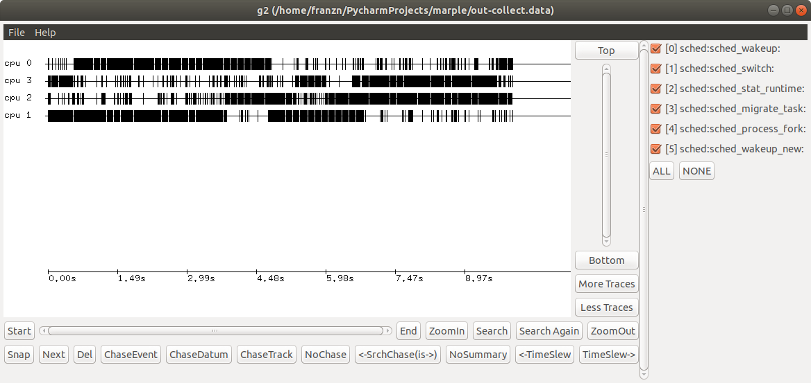
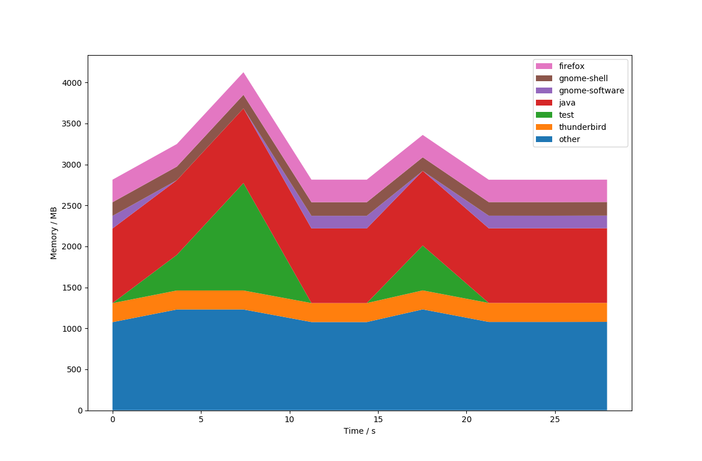
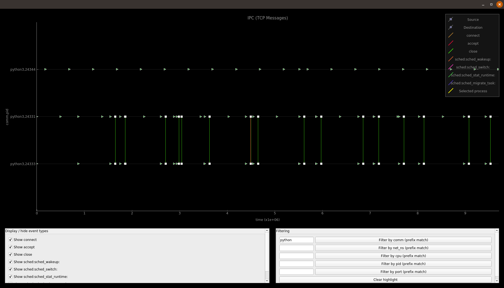

# MARPLE - Multi-tool Analysis of Runtime Performance on Linux Environments

## Description
MARPLE is a performance analysis and visualisation tool for Linux aimed at system-wide profiling, especially for embedded systems. It unifies a wide variety of pre-existing Linux tools such as perf and eBPF into one, simple user interface. MARPLE uses these Linux tools to collect data and write it to disk, and provides a variety of visualisation tools to display the data.

## Installation
1. Install Python 3 and Git.
    ~~~~
    $ sudo apt-get update
    $ sudo apt-get install python3 git
    ~~~~
2. Install MARPLE.
    ~~~~
    $ sudo python3 -m pip install marple
    ~~~~
    Note that `sudo` is not necessary. However, without it `pip` will by default
    install MARPLE scripts at `~/.local/bin`, which is not usually included in the
    `PATH` variable. Ensure it is before proceeding.

3. Setup MARPLE - either manually or automatically.
   1. Automatic setup (***beta***)
       ~~~~
       $ marple_setup
       ~~~~
       This will install the various dependencies required by MARPLE (see below).
       Note in particular that the [FD.io VPP repository](https://wiki.fd.io/view/VPP/g2)
       will be installed into your home directory.

   2. Manual setup
      1. Install `apt` packages
          ~~~
          $ sudo apt-get install perl python3-tkinter libgtk2.0-dev linux-tools-generic linux-tools-common linux-tools-`uname -r`
          ~~~
      2. Install BCC (see [instructions](https://github.com/iovisor/bcc/blob/master/INSTALL.md))
      3. Install G2
          ~~~
          # Clone repository
          git clone https://gerrit.fd.io/r/vpp
          cd vpp
          git reset --hard 4146c65f0dd0b5412746064f230b70ec894d2980

          # Setup
          cd src
          libtoolize
          aclocal
          autoconf
          automake --add-missing
          autoreconf

          # Install
          cd ../build-root
          make --silent g2-install
          ~~~

4. MARPLE is now installed, and can be run by invoking the `marple` command, as
described in [the usage section.](#usage). When you first use MARPLE, it will
create a config file at `~/.marpleconfig`. If you have installed G2 manually,
ensure that the config file has the correct path to your G2 executable.

5. You can also run MARPLE unit tests:
    ~~~~
    $ marple_test
    ~~~~
## Usage
MARPLE can be separately invoked to either collect or display data.
~~~~
usage: sudo marple (--collect | --display) [-h] [options]
~~~~
Or alternatively:
~~~~
usage: sudo marple (-c | -d) [-h] [options]
~~~~
You may wish to set an alias in your `~/.bashrc`:
~~~~
alias marple="sudo `which marple`"
~~~~

### Collecting data
~~~~
usage: sudo marple --collect [-h] [-o OUTFILE] [-t TIME]
                             subcommand [subcommand ...]

Collect performance data.

optional arguments:
  -h, --help            show this help message and exit

  subcommand            interfaces to use for data collection.

                        When multiple interfaces are specified, they will all
                        be used to collect data simultaneously.
                        Users can also define their own groups of interfaces
                        using the config file.

                        Built-in interfaces are:
                            cpusched, disklat, mallocstacks, memusage, memtime,
                            callstack, ipc, memevents, diskblockrq, perf_malloc,
                            lib
                        Current user-defined groups are:
                            boot: memleak,cpusched,disklat

  -o OUTFILE, --outfile OUTFILE
                        specify the data output file.

                        By default this will create a directory named
                        'marple_out' in the current working directory, and
                        files will be named by date and time.
                        Specifying a file name will write to the 'marple_out'
                        directory - pass in a path to override the save
                        location too.

  -t TIME, --time TIME  specify the duration for data collection (in seconds)
~~~~

The subommands are listed below. Each one collects either event-based, stack-based, or 2D point-based data.
* `cpusched`: collect CPU scheduling event-based data (requires /proc/sys/kernel/sched_schedstats to be set to 1 to record iowaits, waits and sleeps).
* `disklat`: collect disk latency point-based data.
* `mallocstacks`: collect `malloc()` call information (including call graph data and size of allocation) as stack-based data.
* `memusage`: collect outstanding memory allocation data as stack-based data.
* `memtime`: collect data on memory usage over time as point data.
* `callstack`: collect call stack data.
* `ipc`: collect inter-process communication (IPC) data via TCP as event-based data.
* `memevents`: collect memory accesses (including call graph data) as stack-based data.
* `diskblockrq`: collect disk block accesses as event-based data.
* `perf_malloc`: collect `malloc()` call information (including call graph data) as stack-based data (deprecated).
* `lib`: library load times. Not yet implemented.

MARPLE allows simultaneous collection using multiple subcommands at once - they are simply passed as multiple arguments, or as a custom collection group. Users can define custom collection groups by using the [config file](marple/config.txt). When using many subcommands, all data will be written to a single file.

### Displaying data
~~~~
usage: marple --display [-h] [-l | -e [ENTRY [ENTRY ...]] | --noagg]
                        [-fg | -tm] [-g2 | -plt] [-hm | -sp] [-i INFILE]

Display collected data in desired format

optional arguments:
  -h, --help            show this help message and exit
  -l, --list            list available datasets in data file
  -e [ENTRY [ENTRY ...]], --entry [ENTRY [ENTRY ...]]
                        select dataset(s) from data file
  --noagg               if set, none of the sections in the file will be
                        aggregated
  -fg, --flamegraph     display as flamegraph
  -tm, --treemap        display as treemap
  -g2, --g2             display as g2 image
  -plt, --plot          display as plot
  -hm, --heatmap        display as heatmap
  -sp, --stackplot      display as stackplot

  -i INFILE, --infile INFILE
                        Input file where collected data to display is stored

~~~~
Tree maps and flame graphs can be used to display stack-based data. G2 and the event plotter can be used to display event-based data. Heat maps and stack plots can be used to display 2D point-based data.

In general, MARPLE will not require specification of the display mode - it will determine this itself using defaults in the [config file](marple/config.txt). These can be overriden on a case-by-case basis using the command-line arguments. In particular, if displaying a data file with many data sets, overriding stack-based plots to display as flame graphs by using `-fg` will result in all stack-based data in that file being displayed as a flame graph for example.

One other thing to mention is the possibility to aggregate multiple datasets using the config section [Aggregate]. This can come in handy when the user wants to see different datasets at the same time . Currently only connected events (IPC) and standalone events (CPU scheduling events) can be aggregated, using the event plotter (though in theory the same can be done with stack and point data, but the results are not meaningful).

Note that if collecting and displaying data on the same machine, MARPLE remembers the last data file written - in this case, no display options are necessary and simply invoking `marple -d` will give the correct display.

## Design aims
MARPLE consists of two core packages: [data collection](#the-data-collection package) and [data visualisation](#the-data-display-package). These two share some [common modules](#common-modules). Two key aims of the design are:

 * **Ease-of-use**: the user should not have to be concerned with the underlying tools used to analyse system performance. Instead, they simply specify the part of the system they would like to analyse, and MARPLE does the rest.

 * **Separation of data collection and visualisation**: the data collection module writes a data file to disk, which is later used by the visualisation module. Importantly, these two phases do not need to be run on the same machine. This allows data to be collected by one user, and sent off elsewhere for analysis by another user.

The workflow for using MARPLE is as follows:

 1. **Collect data** - specify areas of interest and duration of collection as [command line arguments](#collecting-data), and MARPLE will collect data and write it to disk.

 2. *(optional)* **Transfer collected data to another machine** - the data can be moved to another machine and still viewed.

 3. **Display data** - specify the input data file, and MARPLE will automatically select the best visualiser to display this data. Alternatively, defaults can be set in the [configuration file](#configuration) or pass as [command line arguments](#displaying-data).

## Data collection tools used by MARPLE

There are a few different tools used to collect data, and the interfaces to these are detailed below.

### Perf

Sometimes referred to as `perf-events`, `perf` is a Linux performance-analysis tool built into Linux from kernel version 2.6.31. It has many subcommands and can be difficult to use.

Currently, MARPLE can collect data on the following aspects of the system using `perf`:
  * Memory: load and store events (with call graph information)
  * Memory: calls to malloc (with call graph information)
  * Stack: stack traces
  * CPU: scheduling events
  * Disk: block requests

 For more information on `perf`, see [Brendan Gregg's blog](http://www.brendangregg.com/perf.html).

### Iosnoop

This is another Linux tool, designed for usage on Linux kernel versions 3.2 and later. It is part of Brendan Gregg's [perf-tools](https://github.com/brendangregg/perf-tools), which use [perf](#perf) and another Linux tool called `ftrace`. `iosnoop` itself uses `ftrace`, and traces disk IO. MARPLE therefore uses `iosnoop` to trace disk latency.

### eBPF and BCC

[Berkeley Packet Filter](https://prototype-kernel.readthedocs.io/en/latest/bpf/ | Extended Berkeley Packet Filter) (eBPF) is derived from the [https://git.kernel.org/pub/scm/linux/kernel/git/torvalds/linux.git/tree/Documentation/networking/filter.txt](Berkeley Packet Filter) (BPF, also known as Linux Socket Filtering or LSF). BPF allows a user-space program to filter any socket, blocking and allowing data based on any criteria. BPF programs are executed in-kernel by a sandboxed virtual machine. Linux makes this process relatively straightforward compared to other UNIX flavours such as BSD - the user simply has to write the code for the filter, then send it to the kernel using a specific function call.

eBPF has extended BPF to give a general in-kernel virtual machine, with hooks throughout the kernel allowing it to trace more than just packets, and do more actions than simple filtering. The user writes a program, which is compiled to BPF bytecode and sent to the kernel. The kernel then ensures that an eBPF program cannot harm the system, using static analysis before loading to ensure that it terminates and is safe to execute. It then uses BPF to execute the program, making use of kernel-/user-space probes for dynamic tracing (kprobes and uprobes respectively) and other tracepoints for static tracing and more (see [the eBPF workflow diagram](#ebpf_workflow)). The eBPF programs also use eBPF maps, a generic data structure for storing resulting information. A single eBPF program can be attached to many events, and many programs can use a single map (and vice-versa). Linux kernel versions 3.15 and onwards support eBPF.

**Figure:** The worflow of using eBPF.

The [BPF Compiler Collection](https://github.com/iovisor/bcc) (BCC) is a "toolkit for creating efficient kernel tracing and manipulation programs", generally requiring Linux kernel version 4.1 or higher. BCC uses eBPF extensively, and makes it simpler to write eBPF programs by providing a Python interfaces to the various tools. The eBPF programs are written in C, and handled as strings in the BCC code. Many useful example tools are provided too (see [the diagram below](#bcc_tools)).

**Figure:** The BCC tools collection.

Currently, MARPLE uses the following BCC tools:
 * `mallocstacks` - traces `libc` `malloc()` function calls for memory allocation, and shows call stacks and the total number of bytes allocated.
 * `memleak` - traces the top outstanding memory allocations, allowing for detection of memory leaks.
 * `tcptracer` - traces TCP `connect()`, `accept()`, and `close()` system call. In MARPLE this is used to monitor inter-process communication (IPC) which uses TCP.

For more information on these tools, see [Brendan Gregg's blog](http://www.brendangregg.com/ebpf.html).

### Smem

The `smem` [memory reporting tool](https://www.selenic.com/smem/) allows the user to track physical memory usage, and takes into account shared memory pages (unlike many other tools). It requires a Linux kernel which provides the "Proportional Set Size" (PSS) metric for reporting a process' proportion of shared memory - this is usually version 2.6.27 or higher. MARPLE uses `smem` to regularly sample memory usage.

The tool has a very high latency - it was initially used as it helpfully sorts the processes recorded by memory usage. This is not strictly necessary however, so a command such as `top` could be used in its place. Alternatively, the `smemcap` is a lightweight version designed to run on resource-constrained systems - see the bottom of [the man page](https://linux.die.net/man/8/smem).

## Data visualisation tools used by MARPLE

#### Flamegraphs
[Brendan Gregg's flame graphs](http://www.brendangregg.com/flamegraphs.html) are a useful visualisation for profiled software, as they show call stack data. An example taken from Brendan Gregg's website is [below](#flame_graph). Flame graphs are interactive, allowing the user to zoom in to a certain process.

**Figure:** An example flame graph, showing CPU usage for a MySQL program.

In general any form of stack data is easily viewed as a flame graph.

#### Tree maps

[Tree maps](http://d3plus.org/examples/advanced/9860411/), like [flamegraphs](#flamegraph), are a useful visualisation tool for call stack data. Unlike flame graphs, which show all levels of the current call stack at any one time, tree maps display only a single level, giving users a more detailed view of that level and the opportunity to drill down into deeper levels. These tree maps are interactive, allowing the user to see useful information on hover, and drill down into each node of the tree. An example tree map `.html` file can be found [here](example_treemap).

#### Heat maps

Heat maps allow three-dimensional data to be visualised, using colour as a third dimension. In MARPLE, heat maps are used as histograms - data is grouped into buckets, and colour is used to represent the amount of data falling in each bucket.

**Figure:** An example heat map, showing disk latency data, showcasing a possbile bottleneck around second 16.

#### G2

[G2](https://wiki.fd.io/view/VPP/g2) is an event-log viewer. It is very efficient and scalable, and is part of the [Vector Packet Processing](https://wiki.fd.io/view/VPP) (VPP) platform. This is a framework providing switch/router functionality, and is the open-source version of Cisco's VPP technology.

See [below](#g2_example) for an example G2 window.

**Figure:** An example G2 window, showing scheduling event data.

G2 has many display features, a few of these are listed below.
 * Pressing the 'c' key will colour the graph.
 * Multiple 'tracks' of events are displayed, and their labels are shown on the left. In the figure above, the tracks are CPU cores.
 * The events are ordered chronologically, with a timescale at the bottom of the screen.
 * Event types can be hidden/shown using the checkboxes on the right.
 * There are navigational and search controls along the bottom of the screen, and in the lower-right conrner.

 For more information, consult the [G2 wiki](https://wiki.fd.io/view/VPP/g2).

#### Stack plots

Stack plots (also known as stacked graphs or stacked charts) show 'parts to the whole'. They are effectively line graphs subdivided to show the various components that make up the overall line value. They can be seen as a form of pie chart, but one that changes with respect to another dimension (usually time). An example stack plot is shown [below](#stackplot_example).

**Figure:** An example stack plot, showing memory usage by process over time for the system, with two spikes indicating possible bottlenecks.

#### Event plotter

The event plotter is a visualization mode aimed at displaying big datasets of events (any type) in a simple, easy to use tool. It has two main areas: the figure and the UI. The figure contains a plot that uses various event information as y axis ticks (usually the process name and the PID, though this can be changed) and time as the x axis ticks, points representing an event and lines connections between the source and the destionation of events that have them (IPC events for example). Events and connecting lines are color coded so that they are easily distinguishable. The colors and the symbols can be seen in the legend. The UI is automatically generated, based on the event data. It provides a way to display only selected plots via checkboxes and to filter based on event properties via comma separated regex. The figure and the UI are redrawn with each filtering, so that they are relevant to the filtered data (y axis ticks that are empty after the filtering are hidden). One thing to mention here is that the original data is saved, so we filter on it, not on the data that is currently displayed.

**Figure:** The event plotter in action, showing two python processes talking to each other via TCP messages, as well as CPU scheduling events for all the processes.

### Miscellaneous
 * MARPLE logs can be found in `/var/log/marple/`.

### Some notes and warnings
 * memtime has a high overhead;
 * perf_malloc, mallocstacks and memusage are not very reliable; while they usually provide useful and fairly correct information, if too much data is generated by any (this will usually be the case since allocation function calls have a very high call frequency) some data might get lost;
 * some display modules might have a long loading times when displaying lots of data (heatmaps, treemaps and the event plotter especially)
 * when collecting with multiple subcommands, MARPLE will profile itself, as in one collecter might detect another one's activity;
 * The collection modules should summarize the data more
